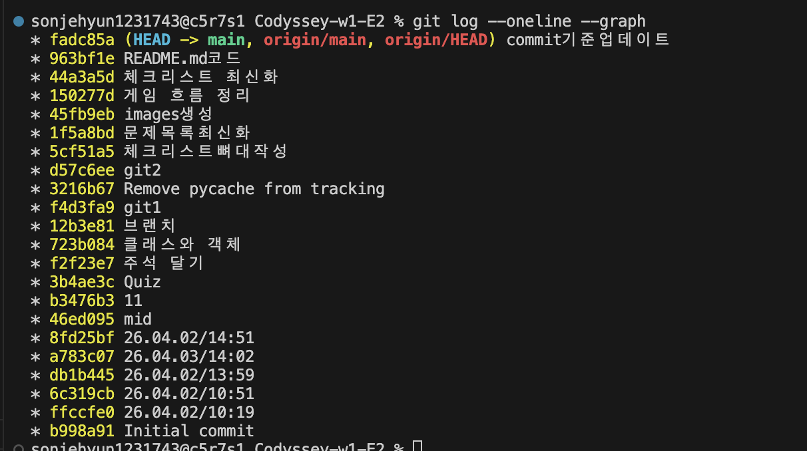

# Codyssey-w1-E2
Codyssey 1주차 E2 문제

## 프로젝트 개요
    - 동작하는 퀴즈 게임 프로그램을 개발
    - python 기초 공부

## 퀴즈 주제 선정 이유
  - 주제: 프로그래밍에 관련된 알아도 그만 몰라도 그만 지식
    - 선정이유: 프로그래밍을 하며 알면 재미있는지식을 알리고 싶었습니다.

## 실행방법 및 기능
1) main.py 실행
2) 숫자입력에 따른 기능
    (1) 퀴즈풀기
        - 저장된 문제 출력/실행 // 점수 누적 및 점수 기억 
    (2) 퀴즈추가
        - 저장된 문제 이외에 사용자가 문제를 낼 수 있도록 함
    (3) 퀴즈목록
        - 저장된 문제 출력
    (4) 점수확인
        - 퀴즈 풀기(1)에서 저장된 최고 점수를 출력
    (5) 종료
        - eixt
    etc. 예외처리(숫자가 아닌 잘못된 입력 처리)
         데이터 저장(종료 후에도 데이터 유지)
         랜덤 문제/선택지 출력
## 게임 흐름
    (1) main.py -> Quizgame() 객체 생성 -> __init__ -> load()호출 
        ```
        game = QuizGame()
        game.run()
        ```

    (2) 데이터 로드 QuizGame.load() -> JSON파일 여부 확인 -> JSON을 Quiz 객체로 변환
        ```
        state.json 있음? -> JSON 읽어서 Quiz 객체 리스트로 변환
        state.json 없음? -> _init_data() 호출 -> 기본 퀴즈 5개 + best_score=0 생성 후 저장
        파일 깨짐?      -> 초기화
        ```

    (3) QuizGame.run() - 게임 시작 - get_int()로 1~5 입력 받고 아닐 시 재입력 요구
    ```
    ==========================================
                🎯 나만의 퀴즈 게임 🎯
    ==========================================
    1. 퀴즈 풀기
    2. 퀴즈 추가
    3. 퀴즈 목록
    4. 점수확인
    5. 종료
    입력>>
    ```
    (4) QuizGame.play() - 풀 문제수 입력 -> random.sample()로 n개 선택 ->
                            - shuffle_choices() → 보기 순서 섞기 + 정답 번호 재계산
                            - display()         → 문제 + 보기 출력
                            - get_int()         → 1~4 답 입력
                            - check()           → 정답 여부 확인, score++
                            -> 최고 점수 출력 (if score > best_score){best_score 갱신 json,self.best score 저장}
    (5) QuizGame.add() - 퀴즈 문제, 선택지, 정답 입력 -> Quiz객체 생성 -> quizzes리스트에 추가 -> json에 저장
    (6) QuizGame.show() - 퀴즈 목록을 메모리 리스트에서 불러와 출력
    (7) 점수 확인 -> self.best_score 출력
    (8) 종료 - 1. 5입력 / 2. ctul+c ctul+d -> 안전종료
## 파일 구조
 Quiz/
 ├── main.py        # 실행 진입점
 ├── Quizgame.py    # 게임 전체 로직
 ├── Quiz.py        # Quiz 클래스 (데이터)
 ├── utils.py       # 입력 처리 함수
 └── state.json     # 데이터 저장/불러오기 파일

## 데이터 파일 설명
### state.json
    - 위치: Qize 디렉토리
    - 역할: 퀴즈 데이터 및 최고 점수 함수 저장
    - 문제:
        1. 버그의 유래는? : 컴퓨터에 벌레가 끼어서
        2. 파이썬의 유래는? : 영국 코미드 그룹
        3. 파이썬의 창시자는? : Guido
        4. 자바와 자바스크립트의 관계는? : 관계 없음
        5. 1GB의 크기는? : 1024MB
```JSON
{ "quizzes": [ //저장된 퀴즈 목록
    {
      "question": "문제 내용",
      "choices": ["보기1", "보기2", "보기3", "보기4"],
      "answer": 1 //정답 번호
    }
  ],
  "best_score": 3 //최고점수 저장
}
```

### main.py
    - 위치: Qize 디렉토리
    - 역할: 퀴즈 게임 실행 및 종료
```main.py
from Quizgame import QuizGame

def main():
    game = QuizGame()

    try:
        game.run()
    except (KeyboardInterrupt, EOFError):
        print("\n안전 종료")
        game.save()

if __name__ == "__main__":
    main()
```

## Python 기초
 - 변수란? : 값이 들어가있는 공간. (변경 가능)
 - int, str, bool, list, dict의 차이
    - int: 소수점이 없는 숫자 = 정수
    - str: 글자들의 묶음 = 문자열
    - bool: 참과 거짓 판별 = 판별기
    - list: 여러개의 값을 순서대로 저장 = 묶음
    - dict: list에서 진화 / 여러가지 이름표 + 값 
 - if/elif/else로 조건
    - if : 만약이라는 뜻으로 조건을 달아 아래 명령 실행
    - elif : if가 아닌 다른 조건으로 명령 실행
    - else : if도 elif도 아닌 나머지 가능성 모두
 - for와 while의 차이
    - for : 정해진 횟수까지 반복
    - while : 정해진 조건까지 반복
 - 함수를 정의하고, 매개변수와 반환값을 활용
    - 함수 정의 
        - def main():dsply(self): save(self): load(self) run(self), play(self), add(self), show(self) etc...
    - 매개변수와 반환값 활용
        - Quiz생성: Quiz(question, choices, answer)

## 클래스와 객체
 - 클래스란? : 데어터 속성 + 데이터를 다루는 매서드
 - __init__ 메서드와 self의 역할
    - __init__역할 : 생성된 객체 초기화, 초기 값 설정.
    - self 역할 : QizeGame내 속성과 메서드에 접근할수 있게함.
    ```QuizGame
        def __init__(self):
        self.quizzes = []   #퀴즈 목록
        self.best_score = 0 #최고점수
        self.load()         #시작 시 데이터를 가져옴.
    ```

## 파일입출력
 - 파일을 열고, 읽고, 쓰는 기본 과정
    - 열기: content = f.read()
    - 읽기: f = open("파일명", "명령")
        - r: 읽기 / w : 쓰기 / a : 추가
    - 쓰기: f = open("data.txt", "w")
            f.write("hello")
 - JSON 형식이 무엇이고, 왜 데이터 저장에 사용
    - JSON: 데이터를 구조화해서 저장하는 텍스트
    - 사용 이유 1. 구조유지 / 2. 파일로 저장 가능 / 3. 다양한언어에서 사용 가능
 - try/except 필요 이유
    - 오류로 인한 프로그램 중단 방지 및 흐름 유지, 데이터 손상 방지
    - 발생 가능한 실패 케이스: 

## Git기초
 - Git이란? : 파일 변경내용 관리도구
 - Git명령어
    - init : git 저장소 초기화
    - add : 새롭게 업데이트된 파일을 스테이징 영역에 올림
    - commit : 스테이징 파일을 로컬 저장소에 저장함 (+꼬리표)
    - push: github에 commit 한 내용을 올림
    - pull: github에서 commit 한 내용을 내려받음
    - checkout: 다른 브랜치로 이동하거나 특정 시점 파일 복구시 사용
    - clone: github에서 프로그램을 불러옴 git clone github주소 
 - 브랜치 : 작업 흐름을 분리하는 독립된 작업라인.
 
    - main안정 but 새로운 기능 추가 할 때 사용.
    -   main:     A --- B --- C
                         \
        feature:          D --- E
        
    - 브랜치 사용 순서
        1) git branch feature / 생성
        2) git switch feature / main->feature로 변경
        3) git switch main / feature->main으로 변경
        4) git merge feature / main + faeture해서 새로운 커밋 생성.
 - 원격저장소를 clone하고 pull로 변경사항 적용(스크린샷)

 ## 체크리스트
    []GitHub에 코드가 업로드되어 있고 10개 이상의 의미 있는 커밋이 존재
        
        - https://github.com/sonjehyun123-maker/Codyssey-w1-E2
    []커밋을 어떤 단위로 나누었고, 커밋 메시지 규칙
        초반에는 커밋을 시간 단위로 무분별하게 기록하고, 메시지 또한 의미 없이 작성하였다.
        이후에는 커밋 단위를 하나의 기능 구현 또는 변경 사항 단위로 명확히 나누었으며, 
        커밋 메시지는 어떤 기능을 새로 적었는지, 어떤 코드를 고쳤는지 같이 적어 작업 내용을 구체적으로 작성하도록 개선하였다.

    []Quiz와 QuizGame 등 클래스들의 책임을 어떻게 나눴는지 설명할 수 있는가?
        - Quiz: 데이터 관리, 보관
        - QuizGames: 게임흐름 진행 
            - Quiz 객체 리스트 배열
            - Quiz데이터를 활용하여 실제로 게임이 동작하게 함
            - json파일 없을시 기초데이터로 생성

    []state.json 데이터 구조(필드/중첩 구조)를 현재 형태로 설계한  + json으로 데잍 저장 이유/특징
        - 사람이 직접 읽고 수정 가능
        - Python 내장 json 모듈로 별도 설치 없이 사용 가능
        - to_dict() / from_dict()로 객체 ↔ JSON 변환이 단순함

    []퀴즈 데이터가 1000개 이상으로 늘어난다면 현재 JSON 저장 방식에 어떤 한계
        load()시 전체를 한 번에 메모리에 올림 → 데이터가 클수록 느려짐
        save()도 전체를 덮어씀 → 퀴즈 1개 추가해도 1000개 전부 다시 씀
        검색/필터 기능이 없어서 특정 퀴즈 찾으려면 전체 순회

    []만약 state.json이 손상되어 JSON 파싱에 실패한다면, 사용자가 데이터를 잃지 않도록 어떤 대응(복구/백업/초기화)이 가능한지 설명
        ① 백업 파일 유지
        save() 호출 시 state.json → state_backup.json 복사 후 저장
        손상 감지 시 백업에서 복구

        ② 임시 파일로 안전 저장
        state_tmp.json에 먼저 쓰고
        성공하면 state.json으로 이름 변경 (덮어쓰기 실패 방지)

        ③ 손상 감지 시 사용자에게 선택권 부여
        "파일 손상 - 1.백업복구 2.초기화" 선택하게 함

    []“정답 채점 방식(점수 계산)”이나 “퀴즈 구조(선택지 개수 등)” 요구사항이 바뀐다면, 어떤 파일/클래스/메서드를 수정
        -----------------------------------------------------
        변경 내용           |      수정 파일/메서드점수
        -----------------------------------------------------
        계산 방식           |      QuizGame.play()
        선택지 수 변경       |      Quiz.__init__, display(), get_int() 범위, _init_data()
        정답 채점 기준 변경   |      Quiz.check()
        -----------------------------------------------------

    []clone/pull
        - git clone (github주소)
        
        - git pull origin main
        ```
        From https://github.com/sonjehyun123-maker/Codyssey-w1-E2
        * branch            main       -> FETCH_HEAD
        Already up to date.
        ```
    [] “입력 처리”, “게임 진행”, “데이터 저장/불러오기” 로직을 어떤 기준으로 분리했는지 설명할 수 있는가?
        - 분리 기준: 하나의 파일/클래스가 하나의 역할만 갖도록 함
        - main.py       : 게임 진입점 / 실행
        - Quiz.py       : 퀴즈 데이터 구조 
        - QuizGame.py   : 게임 진행+저장+불러오기 
        - utils.py      : 입력처리/안전 종료

    [] 클래스를 사용한 이유는 무엇이며, 함수만으로 구현할 때와 어떤 차이가 있는지 설명할 수 있는가?
        - 클래스 = 데이터 + 동작 : 객체를 생성하여 데이터, 동작을 한번에 동작하게 함.
        - 함수만으로 했을 때: 데이터와 동작이 묶여있지 않아 매번 return값을 넘기고 받아야함. + 함수 추적의 어려움.
## 코드
```main
from Quizgame import QuizGame

def main():
    game = QuizGame() #객체 생성

    try:
        game.run() 
    except (KeyboardInterrupt, EOFError): #ctrl+c 종료
        print("\n안전 종료")
        game.save()
# 이 파일이 직접 실행될 때만 main() 실행
if __name__ == "__main__":
    main()
```

```Quiz
import random

class Quiz:
# 문제, 선택지, 정답 저장
    def __init__(self, question, choices, answer):

        self.question = question # 퀴즈 데이터 저장 //play, show
        self.choices = choices # 최고점수 비교 갱신
        self.answer = answer 
#문제 출력
    def display(self):
        print(f"\nQ. {self.question}")
        for i, c in enumerate(self.choices, 1):
            print(f"{i}. {c}") #선택지 번호와 함꼐 출력

#정답 확인
    def check(self, user):
        return self.answer == user

#정답 ,선택지 rand%
    def shuffle_choices(self):
        indexed = list(enumerate(self.choices))
        random.shuffle(indexed)

        self.choices = [c for _, c in indexed]
        #정답위치 다시 계산
        for new_idx, (old_idx, _) in enumerate(indexed):
            if old_idx + 1 == self.answer:
                self.answer = new_idx + 1
                break

# JSON 저장용 변환
    def to_dict(self):
        return {
            "question": self.question,
            "choices": self.choices,
            "answer": self.answer
        }

    @staticmethod
    def from_dict(data):
        #정답, 선택지, 답 JSON->객체
        return Quiz(data["question"], data["choices"], data["answer"])
```

```Quizgame
import json, os, random
from Quiz import Quiz
from utils import get_int

STATE = "state.json" #저장파일

class QuizGame:
    def __init__(self):
        self.quizzes = []   #퀴즈 목록
        self.best_score = 0 #최고점수
        self.load()         #시작 시 데이터를 가져옴.

    def load(self):
        try:
            # 파일 없으면 초기 데이터 생성
            if not os.path.exists(STATE):
                self._init_data()
                return
            #JSON파일 생성
            with open(STATE, encoding="utf-8") as f:
                data = json.load(f)
            # JSON → 객체 변환
            self.quizzes = [Quiz.from_dict(q) for q in data.get("quizzes", [])]
            self.best_score = data.get("best_score", 0)

        except:
            # 파일 깨지면 초기화
            print("파일 손상 → 초기화")
            self._init_data()

    def save(self):
        # 객체 → JSON 저장        
        data = {
            "quizzes": [q.to_dict() for q in self.quizzes],
            "best_score": self.best_score
        }

        with open(STATE, "w", encoding="utf-8") as f:
            json.dump(data, f, ensure_ascii=False, indent=4)

    def _init_data(self):
        self.quizzes = [
            Quiz("버그(Bug)라는 용어의 실제 유래는?", ["벌레처럼 작아서","시스템을 갉아먹어서","개발자가 벌레를 싫어해서","실제 벌레가 기계에 끼어서"], 4),
            Quiz("파이썬 이름의 유래는?", ["고대도시이름","그리스로마신화","영국 코미디 그룹","미국 미식축구팀"], 3),
            Quiz("파이썬 창시자는?", ["Guido","Elon","Bill","Jobs"], 1),
            Quiz("Java와 JavaScript의 관계는?", ["아무관련 없음","부모 자식관계","웹 전용 자바버전","같은 회사 제품"], 1),
            Quiz("1GB는 몇 MB인가요?", ["1024","1000","1111","1234"], 1),
        ]
        self.best_score = 0
        self.save()

    def run(self):
        while True:
            print("========================================\n")
            print("\t 🎯 나만의 퀴즈 게임 🎯\t\n")
            print("========================================")
            print("1. 퀴즈 풀기\n2. 퀴즈 추가\n3. 퀴즈 목록\n4. 점수확인\n5. 종료")
            print("========================================\n")
            try:
                c = get_int("선택: ", 1, 5)
            except:
                raise

            if c == 1: self.play()
            elif c == 2: self.add()
            elif c == 3: self.show()
            elif c == 4: print("최고 점수:", self.best_score)
            elif c == 5:
                self.save()
                print("종료")
                break
# 퀴즈 진행
    def play(self):
        if not self.quizzes:
            print("퀴즈 없음")
            return

        count = get_int("몇 문제 풀래? ", 1, len(self.quizzes))
        selected = random.sample(self.quizzes, count)

        score = 0

        for q in selected:
            q.shuffle_choices() #rand%
            q.display()         #출력

            ans = get_int("답: ", 1, 4)

            if q.check(ans):
                print("정답")
                score += 1
            else:
                print(f"오답 (정답: {q.answer})")

        print(f"점수: {score}/{count}")
#현 스코어 > 최고 스코어
        if score > self.best_score:
            self.best_score = score
            print("최고 점수 갱신")
            self.save()
#문제 추가
    def add(self):
        question = input("문제: ").strip()

        choices = []
        for i in range(4):
            while True:
                c = input(f"선택지 {i+1}: ").strip()
                if c:
                    choices.append(c)
                    break
                print("빈 입력 불가")

        ans = get_int("정답 번호 (1~4): ", 1, 4)

        self.quizzes.append(Quiz(question, choices, ans))
        self.save()

        print("추가 완료")
#퀴즈 목록 출력
    def show(self):
        if not self.quizzes:
            print("퀴즈 없음")
            return

        print("\n===== 퀴즈 목록 =====")
        for i, q in enumerate(self.quizzes, 1):
            print(f"{i}. {q.question}")
```

```utils
def get_int(prompt, min_v, max_v):
    while True:
        try: #에러 대비
            raw = input(prompt).strip() #입력 받기
            #빈칸 확인
            if not raw:
                print("입력 필요")
                continue
            # 문자열 -> 정수
            val = int(raw)
            # 범위 검사
            if not (min_v <= val <= max_v):
                print(f"{min_v}~{max_v} 범위 입력")
                continue
            
            return val
        # 숫자가 아닐 경우
        except ValueError:
            print("숫자만 입력")
        #사용자가 Ctrl + c를 누르거나 Ctul + d를 누르면 출력
        except (KeyboardInterrupt, EOFError):
            print("\n안전 종료 중...")
            raise
```

```state.json
{
    "quizzes": [
        {
            "question": "버그(Bug)라는 용어의 실제 유래는?",
            "choices": [
                "벌레처럼 작아서",
                "시스템을 갉아먹어서",
                "개발자가 벌레를 싫어해서",
                "실제 벌레가 기계에 끼어서"
            ],
            "answer": 4
        },
        {
            "question": "파이썬 이름의 유래는?",
            "choices": [
                "고대도시이름",
                "그리스로마신화",
                "영국 코미디 그룹",
                "미국 미식축구팀"
            ],
            "answer": 3
        },
        {
            "question": "파이썬 창시자는?",
            "choices": [
                "Guido",
                "Elon",
                "Bill",
                "Jobs"
            ],
            "answer": 1
        },
        {
            "question": "Java와 JavaScript의 관계는?",
            "choices": [
                "웹 전용 자바버전",
                "아무관련 없음",
                "부모 자식관계",
                "같은 회사 제품"
            ],
            "answer": 2
        },
        {
            "question": "1GB는 몇 MB인가요?",
            "choices": [
                "1024",
                "1000",
                "1111",
                "1234"
            ],
            "answer": 1
        }
    ],
    "best_score": 1
}
```


12321314